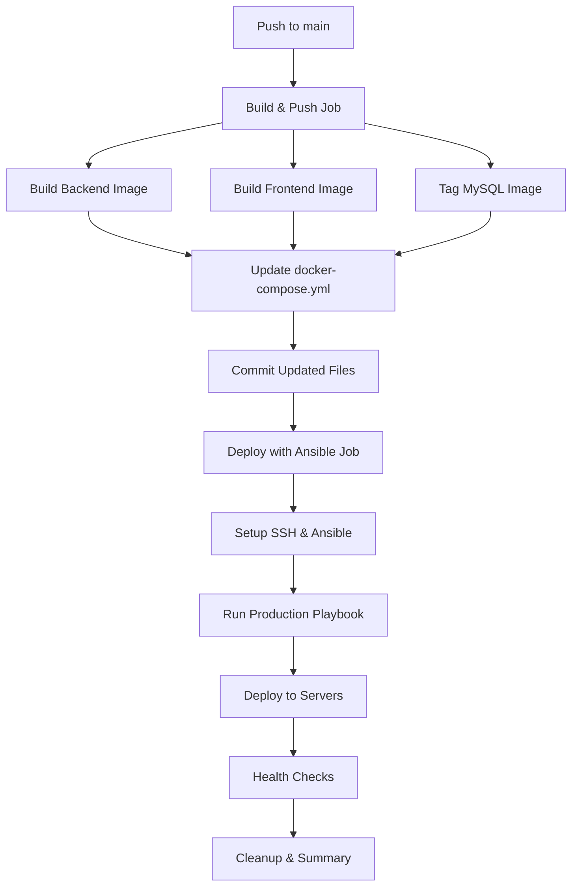

# 🚀 Ansible Deployment Workflow Guide

This guide explains how to set up and use the complete Ansible deployment workflow for your microservices.

## 🎯 **Workflow Goals - Status**

| Goal | Status | Implementation |
|------|--------|----------------|
| ✅ Build and push Docker images to GitHub Packages | **COMPLETED** | `ansible-deploy.yml` workflow |
| ✅ Use automated versioning | **COMPLETED** | `v1.0.${{ github.run_number }}` |
| ✅ Auto-update docker-compose.yml with new version | **COMPLETED** | Automatic sed replacement |
| ✅ Trigger Ansible to deploy to EC2 | **COMPLETED** | Full Ansible playbook |
| 🟡 Deploy to Kubernetes cluster | **FUTURE** | Ready for implementation |

## 📁 **Created Files**

```
.github/workflows/
└── ansible-deploy.yml           # 🆕 Main Ansible deployment workflow

ansible/
├── deploy-production.yml        # 🆕 Enhanced production playbook
├── templates/
│   └── docker-compose.production.yml.j2  # 🆕 Production template
├── inventory.ini               # ✅ Existing (configure your servers)
├── deploy.yml                  # ✅ Existing (basic playbook)
└── group_vars/all.yml          # ✅ Existing (variables)
```

## 🚀 **Workflow Features**

### **Build & Push Job:**
- ✅ **Automatic Versioning**: `v1.0.${{ github.run_number }}`
- ✅ **GitHub Container Registry**: Pushes to GHCR
- ✅ **Multi-service Build**: Backend, Frontend, MySQL
- ✅ **Auto-update Compose**: Updates both `docker-compose.yml` and `docker-compose.github.yml`
- ✅ **Git Commit**: Automatically commits updated files

### **Ansible Deploy Job:**
- ✅ **Dependency Management**: Only runs after successful build
- ✅ **SSH Setup**: Secure SSH agent configuration
- ✅ **Ansible Installation**: Automatic Ansible setup
- ✅ **Production Deployment**: Uses enhanced production playbook
- ✅ **Health Checks**: Verifies all services are running
- ✅ **Cleanup**: Removes old images and containers

## 🔧 **Setup Instructions**

### **Step 1: Configure GitHub Secrets**

Go to your repository → Settings → Secrets and variables → Actions

**Required Secrets:**
```
SSH_PRIVATE_KEY = Your SSH private key for server access
```

**Optional Secrets:** (if servers need additional configuration)
```
SERVER_HOST = Your server IP (can be in inventory.ini instead)
SERVER_USER = SSH username (can be in inventory.ini instead)
```

### **Step 2: Configure Ansible Inventory**

Edit `ansible/inventory.ini`:
```ini
[webservers]
production-server ansible_host=YOUR_EC2_IP ansible_user=ubuntu

# For multiple servers:
# server1 ansible_host=3.15.123.456 ansible_user=ubuntu
# server2 ansible_host=3.15.123.457 ansible_user=ubuntu

[webservers:vars]
ansible_python_interpreter=/usr/bin/python3
```

### **Step 3: Test SSH Connection**

```bash
# Test SSH access to your server
ssh -i ~/.ssh/your-key.pem ubuntu@YOUR_EC2_IP

# Test Ansible connectivity
cd ansible
ansible -i inventory.ini webservers -m ping
```

### **Step 4: Deploy**

**Automatic Deployment:**
```bash
# Push to main branch triggers the workflow
git add .
git commit -m "Deploy version v1.0.X"
git push origin main
```

**Manual Deployment:**
```bash
# Trigger workflow manually from GitHub Actions tab
# Or run Ansible directly:
cd ansible
ansible-playbook -i inventory.ini deploy-production.yml \
  --extra-vars "image_version=v1.0.123" \
  --extra-vars "ghcr_owner=shivamsingh163248"
```

## 🔄 **Workflow Execution Flow**



## 📊 **Version Management**

### **Automatic Versioning:**
- **Format**: `v1.0.${{ github.run_number }}`
- **Example**: `v1.0.1`, `v1.0.2`, `v1.0.3`, etc.
- **Incremental**: Each workflow run gets a new version

### **File Updates:**
```bash
# Before deployment:
image: ghcr.io/shivamsingh163248/flask_backend:latest

# After deployment:
image: ghcr.io/shivamsingh163248/flask_backend:v1.0.25
```

## 🏗️ **Production Features**

### **Enhanced Production Playbook** (`deploy-production.yml`):
- ✅ **Comprehensive health checks**
- ✅ **Service dependency management**
- ✅ **Proper error handling**
- ✅ **Production-ready configuration**
- ✅ **Automatic cleanup**
- ✅ **Detailed logging and reporting**

### **Production Docker Compose Template**:
- ✅ **Health checks for all services**
- ✅ **Proper restart policies**
- ✅ **Production environment variables**
- ✅ **Service labels and metadata**
- ✅ **Network isolation**
- ✅ **Volume management**

## 🔍 **Monitoring & Verification**

### **Automatic Health Checks:**
```bash
# Backend health endpoint
curl http://YOUR_SERVER_IP:5000/health

# Frontend accessibility
curl http://YOUR_SERVER_IP:8080

# Service status
docker-compose -f docker-compose.production.yml ps
```

### **GitHub Actions Summary:**
Each deployment creates a summary showing:
- ✅ **Build status** and image versions
- ✅ **Deployment status** and target servers
- ✅ **Service URLs** and health check results
- ✅ **Version information** and change tracking

## 🚨 **Troubleshooting**

### **Common Issues:**

1. **SSH Connection Failed**
   ```bash
   # Check SSH key permissions
   chmod 600 ~/.ssh/your-key.pem
   
   # Test connection
   ssh -i ~/.ssh/your-key.pem ubuntu@YOUR_SERVER_IP
   ```

2. **Ansible Installation Failed**
   ```bash
   # Manual installation on runner
   sudo apt-get update
   sudo apt-get install ansible
   ```

3. **Docker Permission Denied**
   ```bash
   # On target server
   sudo usermod -aG docker $USER
   sudo systemctl restart docker
   ```

4. **Service Health Check Failed**
   ```bash
   # Check logs on server
   docker-compose -f docker-compose.production.yml logs
   ```

## 🎯 **Next Steps**

### **Future Enhancements:**
1. **Kubernetes Deployment** - Add K8s manifests and deployment
2. **Multi-environment Support** - Staging, production environments
3. **Blue-Green Deployment** - Zero-downtime deployments
4. **Monitoring Integration** - Prometheus, Grafana setup
5. **Automated Testing** - Integration tests before deployment

### **Ready for Kubernetes:**
The current setup is Kubernetes-ready. You can easily add:
- Kubernetes manifests in `k8s/` directory
- Helm charts for complex deployments
- ArgoCD for GitOps workflows

## 🎉 **Success Metrics**

After successful deployment, you'll have:
- ✅ **Automated CI/CD pipeline** with version management
- ✅ **Production-ready deployment** with health checks
- ✅ **Scalable infrastructure** ready for multiple servers
- ✅ **Comprehensive monitoring** and error handling
- ✅ **Easy rollback capability** with version tags

**Your microservices are now enterprise-ready!** 🚀
