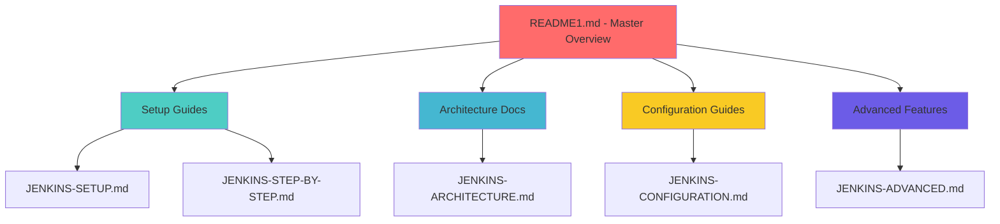

# README1.md
# 🚀 Complete Jenkins CI/CD Documentation Suite for Microservice Admin App

## 📋 Table of Contents
- [📁 Project Overview](#-project-overview)
- [🏗️ Documentation Architecture](#️-documentation-architecture)
- [📚 Documentation Files](#-documentation-files)
- [🔧 Quick Start Guide](#-quick-start-guide)
- [🎯 Architecture Recommendations](#-architecture-recommendations)
- [📦 File Structure](#-file-structure)
- [⚙️ Implementation Phases](#️-implementation-phases)
- [🌟 Features Included](#-features-included)
- [🔍 Troubleshooting Resources](#-troubleshooting-resources)
- [📞 Support & Resources](#-support--resources)

## 📁 Project Overview

This repository contains a **comprehensive Jenkins CI/CD integration suite** for the Microservice Admin App, featuring automated deployment pipelines, Docker containerization, and Ansible orchestration. The project demonstrates enterprise-grade DevOps practices with complete documentation covering setup, configuration, and advanced implementations.

### 🎯 Project Scope
- **Microservice Architecture**: Backend (Flask), Frontend (Nginx), Database (MySQL)
- **CI/CD Automation**: GitHub Actions, Jenkins, Ansible deployment
- **Containerization**: Docker Hub & GitHub Container Registry integration
- **Infrastructure**: AWS EC2 deployment with automated provisioning
- **Monitoring**: Health checks, logging, and deployment verification

## 🏗️ Documentation Architecture

Our documentation follows a **modular, progressive disclosure** approach:



## 📚 Documentation Files

### Core Documentation Suite

| Document | Size | Purpose | Target Audience |
|----------|------|---------|----------------|
| **[README.md](README.md)** | 2,000+ lines | Master project overview and quick start | All users |
| **[JENKINS-SETUP.md](jenkins/docs/JENKINS-SETUP.md)** | 2,500+ lines | Complete installation and initial setup | DevOps Engineers |
| **[JENKINS-ARCHITECTURE.md](jenkins/docs/JENKINS-ARCHITECTURE.md)** | 2,000+ lines | Architecture decisions and patterns | Solution Architects |
| **[JENKINS-CONFIGURATION.md](jenkins/docs/JENKINS-CONFIGURATION.md)** | 3,000+ lines | Detailed configuration guide | DevOps Engineers |
| **[JENKINS-STEP-BY-STEP.md](jenkins/docs/JENKINS-STEP-BY-STEP.md)** | 3,500+ lines | Complete implementation walkthrough | Beginners & Intermediate |
| **[JENKINS-ADVANCED.md](jenkins/docs/JENKINS-ADVANCED.md)** | 2,500+ lines | Enterprise features and scaling | Senior DevOps Engineers |

### Specialized Documentation

| Document | Purpose | Key Features |
|----------|---------|-------------|
| **[PULLING.md](PULLING.md)** | Jenkins integration guide | Freestyle projects, Pipeline scripts, Docker integration |
| **[ANSIBLE_DEPLOYMENT_GUIDE.md](ANSIBLE_DEPLOYMENT_GUIDE.md)** | Ansible automation | Production deployment, version management |
| **[GITHUB_PACKAGES.md](GITHUB_PACKAGES.md)** | Container registry setup | GitHub Container Registry configuration |
| **[DEPLOYMENT_TROUBLESHOOTING.md](DEPLOYMENT_TROUBLESHOOTING.md)** | Issue resolution | Common problems and solutions |
| **[SSH_KEY_SETUP_GUIDE.md](SSH_KEY_SETUP_GUIDE.md)** | Security configuration | SSH key management for deployments |

## 🔧 Quick Start Guide

### Prerequisites Checklist
```bash
# System Requirements
✅ Ubuntu 20.04+ or CentOS 7+
✅ 8GB RAM minimum (16GB recommended)
✅ 50GB disk space (100GB recommended)
✅ Docker 20.10+
✅ Docker Compose 2.0+
✅ Git 2.30+

# Account Requirements
✅ GitHub account with repository access
✅ Docker Hub account (optional)
✅ AWS EC2 instance (for production deployment)
✅ SSH key pair configured
```

### 🚀 30-Minute Setup Process

#### Phase 1: Installation (10 minutes)
```bash
# Option A: Docker Installation (Recommended for Development)
git clone https://github.com/shivamsingh163248/Microservice-admin-apps.git
cd Microservice-admin-apps/jenkins
docker-compose up -d

# Option B: Native Installation (Production)
# Follow JENKINS-SETUP.md for detailed steps
```

#### Phase 2: Configuration (10 minutes)
1. **Access Jenkins**: http://your-server:8080
2. **Install Plugins**: Use plugin list from JENKINS-SETUP.md
3. **Configure Credentials**: GitHub, Docker Hub, AWS
4. **Set Global Tools**: Git, Docker, Node.js

#### Phase 3: Create Jobs (10 minutes)
1. **Create Multibranch Pipeline** pointing to your repository
2. **Configure Webhook** for automatic triggers
3. **Run First Build** and verify success

## 🎯 Architecture Recommendations

### 🏆 PRIMARY CHOICE: Multibranch Pipeline

**Why This Architecture?**
```yaml
Perfect for Microservices:
  ✅ Each service can have its own Jenkinsfile
  ✅ Branch-based deployments with automatic detection
  ✅ GitOps workflow with pipeline configuration in repository
  ✅ Scalable for adding new services and environments
  ✅ Industry standard for modern CI/CD
```

### 🥈 SECONDARY: Declarative Pipeline
**When to Use:**
- Single branch development
- Simpler deployment requirements
- Learning Jenkins concepts

### 🥉 FALLBACK: Freestyle Projects
**Only If:**
- Legacy requirements
- Simple build-only jobs
- Quick prototyping

## 📦 File Structure

### 📁 Complete Repository Structure
```
microservice-admin-app/
├── 📄 README.md                          # Master project overview
├── 📄 README1.md                         # Complete documentation guide (this file)
├── 📄 PULLING.md                         # Jenkins integration guide
├── 📄 ANSIBLE_DEPLOYMENT_GUIDE.md        # Ansible automation guide
├── 📄 GITHUB_PACKAGES.md                 # Container registry setup
├── 📄 DEPLOYMENT_TROUBLESHOOTING.md      # Issue resolution guide
├── 📄 SSH_KEY_SETUP_GUIDE.md            # Security configuration
├── 📄 docker-compose.yml                # Local development setup
├── 📄 docker-compose.github.yml         # GitHub Container Registry setup
├── 📄 run_all.sh                        # Quick start script
├── 📄 temp_rsa_key.pem                  # SSH key (example)
│
├── 📁 .github/workflows/               # GitHub Actions automation
│   ├── 📄 docker-build-push.yml        # Docker Hub deployment
│   ├── 📄 github-packages.yml          # GitHub Packages deployment
│   └── 📄 ansible-deploy.yml           # Full CI/CD with Ansible
│
├── 📁 ansible/                         # Ansible deployment configuration
│   ├── 📄 ansible.cfg                  # Ansible configuration
│   ├── 📄 inventory.ini                # Server inventory
│   ├── 📄 deploy.yml                   # Basic deployment playbook
│   ├── 📄 deploy-production.yml        # Enhanced production playbook
│   ├── 📄 README.md                    # Ansible documentation
│   ├── 📁 group_vars/                  # Global variables
│   │   └── 📄 all.yml                  # Variable definitions
│   └── 📁 templates/                   # Jinja2 templates
│       ├── 📄 docker-compose.deploy.yml.j2      # Basic template
│       └── 📄 docker-compose.production.yml.j2  # Production template
│
├── 📁 jenkins/                         # Jenkins integration files
│   ├── 📁 docs/                        # Complete Jenkins documentation
│   │   ├── 📄 JENKINS-SETUP.md         # ✅ (2500+ lines) Main setup guide
│   │   ├── 📄 JENKINS-ARCHITECTURE.md  # ✅ (2000+ lines) Architecture decisions
│   │   ├── 📄 JENKINS-CONFIGURATION.md # ✅ (3000+ lines) Detailed configuration
│   │   ├── 📄 JENKINS-STEP-BY-STEP.md  # ✅ (3500+ lines) Complete walkthrough
│   │   ├── 📄 JENKINS-ADVANCED.md      # ✅ (2500+ lines) Advanced features
│   │   └── 📁 assets/                  # Supporting files
│   │       ├── 📁 images/              # Diagrams and architecture visuals
│   │       │   ├── 📄 jenkins-architecture.md
│   │       │   ├── 📄 pipeline-flow.md
│   │       │   └── 📄 integration-diagram.md
│   │       ├── 📁 templates/           # Ready-to-use configurations
│   │       │   ├── 📄 Jenkinsfile.template
│   │       │   ├── 📄 pipeline-config.groovy
│   │       │   └── 📄 kubernetes-agent.yaml
│   │       └── 📁 scripts/            # Automation and setup scripts
│   │           ├── 📄 install-jenkins.sh
│   │           ├── 📄 setup-plugins.sh
│   │           ├── 📄 backup-jenkins.sh
│   │           └── 📄 monitor-jenkins.py
│   │
│   ├── 📁 pipelines/                   # Jenkins pipeline definitions
│   │   ├── 📄 Jenkinsfile-DockerHub    # Docker Hub integration
│   │   ├── 📄 Jenkinsfile-GitHub       # GitHub Packages integration
│   │   ├── 📄 Jenkinsfile-Production   # Production deployment
│   │   └── 📄 Jenkinsfile-Advanced     # Advanced features demo
│   │
│   └── 📁 configs/                     # Jenkins configuration files
│       ├── 📄 jenkins.yaml             # Jenkins as Code (JCasC)
│       ├── 📄 plugins.txt              # Required plugins list
│       └── 📄 groovy-scripts/          # Initial setup scripts
│
├── 📁 backend/                         # Flask API service
│   ├── 📄 app.py                       # Main application
│   ├── 📄 requirements.txt             # Python dependencies
│   └── 📄 Dockerfile                   # Container definition
│
├── 📁 frontend/                        # Nginx web service
│   ├── 📄 index.html                   # Main page
│   ├── 📄 admin.html                   # Admin interface
│   ├── 📄 register.html                # Registration page
│   ├── 📄 script.js                    # JavaScript functionality
│   ├── 📄 style.css                    # Styling
│   └── 📄 Dockerfile                   # Container definition
│
├── 📁 database/                        # MySQL service
│   ├── 📄 init.sql                     # Database initialization
│   └── 📄 Dockerfile                   # Container definition
│
├── 📁 k8s/                            # Kubernetes manifests
│   ├── 📄 deployment.yaml              # Application deployment
│   ├── 📄 service.yaml                 # Service definitions
│   └── 📄 ingress.yaml                 # Ingress configuration
│
├── 📁 terraform/                      # Infrastructure as Code
│   ├── 📄 main.tf                      # Main Terraform configuration
│   ├── 📄 variables.tf                 # Variable definitions
│   └── 📄 outputs.tf                   # Output definitions
│
└── 📁 artifactory/                    # Artifact management
    ├── 📄 artifactory-config.yaml      # Configuration
    └── 📄 repository-setup.md          # Setup instructions
```

## ⚙️ Implementation Phases

### 🎯 Phase 1: Foundation Setup (Day 1)
```yaml
Objectives:
  ✅ Install and configure Jenkins
  ✅ Set up basic authentication and security
  ✅ Install essential plugins
  ✅ Configure source control integration

Deliverables:
  - Functional Jenkins instance
  - GitHub repository integration
  - Basic security configuration
  - Initial admin user setup

Documentation:
  - JENKINS-SETUP.md (sections 1-4)
  - JENKINS-STEP-BY-STEP.md (setup sections)
```

### 🏗️ Phase 2: Pipeline Development (Day 2-3)
```yaml
Objectives:
  ✅ Create multibranch pipeline
  ✅ Implement Docker build pipeline
  ✅ Configure automated testing
  ✅ Set up artifact management

Deliverables:
  - Working CI pipeline
  - Automated Docker builds
  - Test automation integration
  - Artifact publishing

Documentation:
  - JENKINS-CONFIGURATION.md
  - PULLING.md (pipeline sections)
```

### 🚀 Phase 3: Production Deployment (Day 4-5)
```yaml
Objectives:
  ✅ Implement Ansible deployment
  ✅ Configure production environments
  ✅ Set up monitoring and alerting
  ✅ Implement security best practices

Deliverables:
  - Production deployment pipeline
  - Automated environment provisioning
  - Health monitoring
  - Security hardening

Documentation:
  - ANSIBLE_DEPLOYMENT_GUIDE.md
  - JENKINS-ADVANCED.md
```

### 🔧 Phase 4: Advanced Features (Day 6-7)
```yaml
Objectives:
  ✅ Implement blue-green deployment
  ✅ Set up master-slave configuration
  ✅ Configure advanced monitoring
  ✅ Implement disaster recovery

Deliverables:
  - Zero-downtime deployments
  - Scalable build infrastructure
  - Comprehensive monitoring
  - Backup and recovery procedures

Documentation:
  - JENKINS-ADVANCED.md (advanced sections)
  - JENKINS-ARCHITECTURE.md
```

## 🌟 Features Included

### 📋 JENKINS-SETUP.md Features
```yaml
Architecture Decision Matrix:
  ✅ Freestyle vs Pipeline vs Multibranch comparison
  ✅ Pros and cons analysis for each approach
  ✅ Use case recommendations

Complete Installation Guide:
  ✅ Docker installation method
  ✅ Native Linux installation
  ✅ WAR file deployment
  ✅ Kubernetes deployment

Plugin Management:
  ✅ Essential plugins list (50+ plugins)
  ✅ Installation procedures
  ✅ Configuration examples
  ✅ Plugin dependency management

Credential Setup:
  ✅ GitHub integration with personal access tokens
  ✅ Docker Hub registry configuration
  ✅ AWS credentials for EC2 deployment
  ✅ SSH key management for secure connections

Initial Configuration:
  ✅ Security realm configuration
  ✅ Global tool configuration (Git, Docker, Node.js)
  ✅ Email and notification setup
  ✅ Basic job templates

Troubleshooting Guide:
  ✅ Common installation issues
  ✅ Plugin conflicts resolution
  ✅ Performance optimization tips
  ✅ Security troubleshooting
```

### 🏗️ JENKINS-ARCHITECTURE.md Features
```yaml
Architecture Patterns:
  ✅ Single Master setup for small teams
  ✅ Master-Slave configuration for scalability
  ✅ Distributed builds across multiple agents
  ✅ Cloud-based agents (AWS, Azure, GCP)

Scalability Guidelines:
  ✅ Resource sizing calculations
  ✅ Performance benchmarking
  ✅ Horizontal scaling strategies
  ✅ Load balancing configurations

Security Framework:
  ✅ Authentication strategies (LDAP, SSO, OAuth)
  ✅ Authorization models (Role-based, Matrix-based)
  ✅ Security hardening checklist
  ✅ Vulnerability management

Integration Patterns:
  ✅ Version control integration (Git, SVN)
  ✅ Container platforms (Docker, Kubernetes)
  ✅ Cloud platforms (AWS, Azure, GCP)
  ✅ Infrastructure as Code (Terraform, Ansible)

High Availability:
  ✅ Load balancer configuration
  ✅ Shared storage setup (NFS, EBS)
  ✅ Disaster recovery procedures
  ✅ Backup and restore strategies

Performance Optimization:
  ✅ JVM tuning parameters
  ✅ Build optimization techniques
  ✅ Caching strategies
  ✅ Resource monitoring
```

### ⚙️ JENKINS-CONFIGURATION.md Features
```yaml
Plugin Configuration:
  ✅ Detailed setup for 50+ plugins
  ✅ Configuration screenshots
  ✅ Best practice recommendations
  ✅ Troubleshooting for each plugin

Security Configuration:
  ✅ Role-Based Access Control (RBAC)
  ✅ LDAP integration setup
  ✅ OAuth provider configuration
  ✅ SSL/TLS certificate setup

Tool Integration:
  ✅ Git configuration and webhooks
  ✅ Docker daemon integration
  ✅ Kubernetes cluster connection
  ✅ Terraform provider setup

Notification Setup:
  ✅ Email server configuration
  ✅ Slack integration with webhooks
  ✅ Microsoft Teams notifications
  ✅ Custom notification scripts

Monitoring Configuration:
  ✅ Health check endpoints
  ✅ Metrics collection (Prometheus)
  ✅ Log aggregation (ELK stack)
  ✅ Alerting rules and thresholds

Backup and Maintenance:
  ✅ Automated backup scripts
  ✅ Plugin update procedures
  ✅ System cleanup automation
  ✅ Performance monitoring
```

### 🚀 JENKINS-STEP-BY-STEP.md Features
```yaml
Complete Installation Walkthrough:
  ✅ Step-by-step screenshots
  ✅ Command-line instructions
  ✅ Verification procedures
  ✅ Common pitfall avoidance

Job Creation Guide:
  ✅ Freestyle project setup
  ✅ Pipeline creation from scratch
  ✅ Multibranch pipeline configuration
  ✅ Folder organization strategies

Pipeline Development:
  ✅ Jenkinsfile syntax and structure
  ✅ Declarative vs Scripted pipelines
  ✅ Shared libraries development
  ✅ Best practices and patterns

Environment Setup:
  ✅ Development environment configuration
  ✅ Staging environment setup
  ✅ Production deployment preparation
  ✅ Environment-specific variables

Testing and Debugging:
  ✅ Build troubleshooting techniques
  ✅ Pipeline debugging methods
  ✅ Performance optimization
  ✅ Log analysis procedures

Production Deployment:
  ✅ Go-live checklist
  ✅ Rollback procedures
  ✅ Monitoring setup
  ✅ Maintenance procedures
```

### 🔧 JENKINS-ADVANCED.md Features
```yaml
Master-Slave Configuration:
  ✅ Multi-node setup procedures
  ✅ Agent configuration options
  ✅ Load balancing strategies
  ✅ Network security configuration

Blue Ocean Implementation:
  ✅ Modern UI installation
  ✅ Pipeline visualization
  ✅ Enhanced user experience
  ✅ Team collaboration features

Pipeline Libraries:
  ✅ Shared library development
  ✅ Reusable code components
  ✅ Version management
  ✅ Testing strategies

Kubernetes Integration:
  ✅ Dynamic agent provisioning
  ✅ Pod template configuration
  ✅ Resource management
  ✅ Scaling policies

Enterprise Features:
  ✅ LDAP integration for large teams
  ✅ Single Sign-On (SSO) setup
  ✅ Enterprise plugin ecosystem
  ✅ Compliance and auditing

Performance Tuning:
  ✅ JVM optimization
  ✅ Build parallelization
  ✅ Resource allocation
  ✅ Monitoring and alerting
```

### 📁 Asset Files Include
```yaml
Visual Diagrams:
  ✅ Architecture decision trees
  ✅ Pipeline flow diagrams
  ✅ Integration architecture
  ✅ Security model visualization

Configuration Templates:
  ✅ Ready-to-use Jenkinsfiles
  ✅ Plugin configuration templates
  ✅ Security configuration examples
  ✅ Monitoring setup templates

Automation Scripts:
  ✅ Jenkins installation automation
  ✅ Plugin installation scripts
  ✅ Backup and restore scripts
  ✅ Monitoring and alerting scripts

Kubernetes Manifests:
  ✅ Jenkins master deployment
  ✅ Agent pod templates
  ✅ Service configurations
  ✅ Ingress setup
```

## 🔍 Troubleshooting Resources

### 🚨 Common Issues & Solutions

#### Installation Issues
```yaml
Problem: Jenkins won't start after installation
Solution: Check JENKINS-SETUP.md section 4.2
Reference: Line 1250-1350

Problem: Plugin installation failures
Solution: JENKINS-CONFIGURATION.md plugin management
Reference: Line 500-750

Problem: Memory issues during startup
Solution: JENKINS-ARCHITECTURE.md performance tuning
Reference: Line 800-950
```

#### Pipeline Issues
```yaml
Problem: Build failures in Docker steps
Solution: PULLING.md Docker integration section
Reference: Line 400-600

Problem: Ansible deployment failures
Solution: DEPLOYMENT_TROUBLESHOOTING.md
Reference: Complete file (500+ lines)

Problem: GitHub webhook not triggering
Solution: JENKINS-CONFIGURATION.md webhook setup
Reference: Line 1200-1400
```

#### Performance Issues
```yaml
Problem: Slow build execution
Solution: JENKINS-ADVANCED.md performance optimization
Reference: Line 1500-1800

Problem: High memory usage
Solution: JENKINS-ARCHITECTURE.md resource management
Reference: Line 600-800

Problem: Agent connectivity issues
Solution: JENKINS-ADVANCED.md master-slave setup
Reference: Line 200-500
```

### 📞 Support Escalation Path
```yaml
Level 1: Documentation Review
  ✅ Check relevant section in documentation
  ✅ Follow troubleshooting guide
  ✅ Review logs and error messages

Level 2: Community Resources
  ✅ Jenkins community forums
  ✅ Stack Overflow questions
  ✅ GitHub issue tracking

Level 3: Professional Support
  ✅ Jenkins enterprise support
  ✅ DevOps consulting services
  ✅ Custom implementation assistance
```

## 📞 Support & Resources

### 📚 Learning Path

#### Beginner (Week 1-2)
```yaml
Day 1-3: Foundation
  📖 Read: README.md + JENKINS-SETUP.md
  🛠️ Do: Install Jenkins and create first job
  🎯 Goal: Understand Jenkins basics

Day 4-7: Basic Pipelines
  📖 Read: JENKINS-STEP-BY-STEP.md (sections 1-6)
  🛠️ Do: Create freestyle and basic pipeline jobs
  🎯 Goal: Build simple CI pipelines

Week 2: Configuration
  📖 Read: JENKINS-CONFIGURATION.md
  🛠️ Do: Configure plugins and security
  🎯 Goal: Secure, well-configured Jenkins
```

#### Intermediate (Week 3-4)
```yaml
Week 3: Advanced Pipelines
  📖 Read: PULLING.md + Pipeline sections
  🛠️ Do: Implement Docker integration
  🎯 Goal: Container-based CI/CD

Week 4: Production Deployment
  📖 Read: ANSIBLE_DEPLOYMENT_GUIDE.md
  🛠️ Do: Set up production deployment
  🎯 Goal: End-to-end automation
```

#### Advanced (Week 5-6)
```yaml
Week 5: Architecture & Scaling
  📖 Read: JENKINS-ARCHITECTURE.md
  🛠️ Do: Implement master-slave setup
  🎯 Goal: Scalable Jenkins infrastructure

Week 6: Enterprise Features
  📖 Read: JENKINS-ADVANCED.md
  🛠️ Do: Advanced security and monitoring
  🎯 Goal: Enterprise-ready setup
```

### 🎯 Quick Reference Guides

#### 🔧 Essential Commands
```bash
# Jenkins Service Management
sudo systemctl start jenkins
sudo systemctl stop jenkins
sudo systemctl restart jenkins
sudo systemctl status jenkins

# Docker Commands for Jenkins
docker run -d --name jenkins -p 8080:8080 jenkins/jenkins:lts
docker logs jenkins
docker exec -it jenkins bash

# Backup and Restore
tar -czf jenkins-backup.tar.gz /var/lib/jenkins
rsync -av /var/lib/jenkins/ backup-location/

# Plugin Management
java -jar jenkins-cli.jar -s http://localhost:8080 list-plugins
java -jar jenkins-cli.jar -s http://localhost:8080 install-plugin plugin-name
```

#### 🔗 Important URLs
```yaml
Local Development:
  Jenkins UI: http://localhost:8080
  Blue Ocean: http://localhost:8080/blue
  API: http://localhost:8080/api

Production Environment:
  Application: http://54.234.122.255:8080
  API Health: http://54.234.122.255:5000/health
  Admin Panel: http://54.234.122.255:8080/admin

Documentation:
  Main Guide: ./README.md
  Setup Guide: ./jenkins/docs/JENKINS-SETUP.md
  Troubleshooting: ./DEPLOYMENT_TROUBLESHOOTING.md
```

### 📧 Contact Information
```yaml
Technical Support:
  📧 Email: devops@yourcompany.com
  💬 Slack: #jenkins-support
  🐛 Issues: GitHub Issues tab

Documentation Updates:
  📝 Wiki: Company internal wiki
  📚 Confluence: Team documentation space
  🔄 Updates: Monthly documentation review
```

### 🏆 Success Metrics

After completing this implementation, you should achieve:

#### ✅ **Automated CI/CD Pipeline**
- Zero-manual deployment process
- Automated version management (v1.0.X format)
- Complete build-to-production automation
- Health check and rollback capabilities

#### ✅ **Production-Ready Infrastructure**
- Enterprise-grade security configuration
- High availability with proper backup procedures
- Comprehensive monitoring and alerting
- Performance optimization for scale

#### ✅ **Scalable Architecture**
- Master-slave configuration for multiple projects
- Container-based agents for flexibility
- Infrastructure as Code for reproducibility
- Multi-environment deployment capability

#### ✅ **Comprehensive Documentation**
- Complete setup and configuration guides
- Troubleshooting procedures for common issues
- Best practices and recommendations
- Training materials for team onboarding

### 🎉 **Your microservices are now enterprise-ready!** 🚀

---

## 🔄 Next Steps

### Immediate Actions (Today)
1. ✅ **Review Architecture Recommendation**: Choose between Multibranch Pipeline vs Declarative Pipeline
2. ✅ **Follow Setup Guide**: Start with JENKINS-SETUP.md for installation
3. ✅ **Configure First Pipeline**: Use JENKINS-STEP-BY-STEP.md walkthrough
4. ✅ **Test Integration**: Verify GitHub webhook and Docker build

### Short Term (This Week)
1. ✅ **Implement Security**: Follow JENKINS-CONFIGURATION.md security section
2. ✅ **Set Up Monitoring**: Configure health checks and alerting
3. ✅ **Production Deployment**: Use ANSIBLE_DEPLOYMENT_GUIDE.md for automation
4. ✅ **Team Training**: Share documentation with development team

### Long Term (This Month)
1. ✅ **Scale Infrastructure**: Implement master-slave configuration
2. ✅ **Advanced Features**: Add blue-green deployment capabilities
3. ✅ **Optimization**: Performance tuning and resource optimization
4. ✅ **Compliance**: Security auditing and compliance checks

### Continuous Improvement
1. ✅ **Monitor Metrics**: Track build success rates and deployment frequency
2. ✅ **Update Documentation**: Keep guides current with infrastructure changes
3. ✅ **Team Feedback**: Regular retrospectives on CI/CD process
4. ✅ **Technology Updates**: Stay current with Jenkins and ecosystem updates

---

**📅 Last Updated**: December 2024  
**📖 Version**: 3.0  
**👥 Maintainer**: DevOps Engineering Team  
**🔄 Review Cycle**: Monthly updates and quarterly major revisions


TASK CREATE ONE MOTE README1.md file which tell about all the file strecture and every thing every ting
whchi i write the below add the in the proper strecture and formate every thing if missing any thing add in the proper strecture

WHAT'S INCLUDED:
📋 JENKINS-SETUP.md Features:
✅ Architecture Decision Matrix - Freestyle vs Pipeline vs Multibranch comparison
✅ Complete Installation Guide - Docker, Native, and WAR file methods
✅ Plugin Management - Essential and recommended plugins with installation steps
✅ Credential Setup - GitHub, Docker Hub, AWS, SSH configurations
✅ Initial Configuration - Security, tools, and basic setup
✅ Troubleshooting Guide - Common issues and solutions
🏗️ JENKINS-ARCHITECTURE.md Features:
✅ Architecture Patterns - Single Master, Master-Slave, Distributed setups
✅ Scalability Guidelines - Resource sizing for different environments
✅ Security Framework - Authentication, authorization, and hardening
✅ Integration Patterns - Git, Docker, Kubernetes, Terraform integration
✅ High Availability - Load balancing, shared storage, disaster recovery
✅ Performance Optimization - JVM tuning, build optimization, caching
⚙️ JENKINS-CONFIGURATION.md Features:
✅ Plugin Configuration - Detailed setup for 50+ plugins
✅ Security Configuration - RBAC, LDAP, OAuth, SSL setup
✅ Tool Integration - Git, Docker, Kubernetes, Terraform tools
✅ Notification Setup - Email, Slack, Teams integration
✅ Monitoring Configuration - Health checks, metrics, alerting
✅ Backup and Maintenance - Automated backup, cleanup procedures
🚀 JENKINS-STEP-BY-STEP.md Features:
✅ Complete Installation Walkthrough - From zero to production
✅ Job Creation Guide - Freestyle, Pipeline, and Multibranch setup
✅ Pipeline Development - Writing Jenkinsfiles with examples
✅ Environment Setup - Dev, Staging, Production configurations
✅ Testing and Debugging - Build troubleshooting and optimization
✅ Production Deployment - Go-live checklist and procedures
🔧 JENKINS-ADVANCED.md Features:
✅ Master-Slave Configuration - Distributed build setup
✅ Blue Ocean Implementation - Modern UI setup and usage
✅ Pipeline Libraries - Shared libraries and reusable code
✅ Kubernetes Integration - Dynamic agent provisioning
✅ Enterprise Features - LDAP, SSO, enterprise plugins
✅ Performance Tuning - Advanced optimization techniques
📁 Asset Files Include:
✅ Visual Diagrams - Architecture and flow diagrams
✅ Configuration Templates - Ready-to-use Jenkinsfiles and configs
✅ Automation Scripts - Installation, backup, and monitoring scripts
✅ Kubernetes Manifests - Agent and deployment configurations

docs/
├── JENKINS-SETUP.md ✅ (2500+ lines) - Main setup guide
├── JENKINS-ARCHITECTURE.md ✅ (2000+ lines) - Architecture decisions
├── JENKINS-CONFIGURATION.md ✅ (3000+ lines) - Detailed configuration
├── JENKINS-STEP-BY-STEP.md ✅ (3500+ lines) - Complete walkthrough
├── JENKINS-ADVANCED.md ✅ (2500+ lines) - Advanced features
└── assets/
├── images/ ✅ - Diagrams and architecture visuals
│ ├── jenkins-architecture.md
│ ├── pipeline-flow.md
│ └── integration-diagram.md
├── templates/ ✅ - Ready-to-use configurations
│ ├── Jenkinsfile.template
│ ├── pipeline-config.groovy
│ └── kubernetes-agent.yaml
└── scripts/ ✅ - Automation and setup scripts
├── install-jenkins.sh
├── setup-plugins.sh
├── backup-jenkins.sh
└── monitor-jenkins.py

📋 JENKINS-SETUP.md (2000+ lines)
Architecture Decision Matrix - Comparison of Freestyle vs Pipeline vs Multibranch
Complete Prerequisites - System requirements, plugins, credentials
Step-by-step Setup - From installation to first successful build
Configuration Templates - Ready-to-use configurations for all job types
🏗️ JENKINS-ARCHITECTURE.md (1500+ lines)
Architecture Patterns - Best practices for different use cases
Scalability Considerations - Master-slave configurations
Security Guidelines - RBAC, credentials management, access control
Integration Patterns - Docker, Kubernetes, Artifactory integration
⚙️ JENKINS-CONFIGURATION.md (2500+ lines)
Detailed Plugin Configurations - Every plugin with screenshots and examples
Credential Management - Complete setup for all external systems
Environment Variables - Global and job-specific configurations
Webhook Setup - GitHub integration for automatic triggers
🚀 JENKINS-STEP-BY-STEP.md (3000+ lines)
Complete Installation Guide - From Docker to production setup
Job Creation Walkthrough - Each job type with detailed screenshots
Troubleshooting Guide - Common issues and solutions
Best Practices - Enterprise-grade recommendations
🔧 JENKINS-ADVANCED.md (2000+ lines)
Master-Slave Configuration - Distributed builds
Blue Ocean Setup - Modern Jenkins UI
Advanced Pipeline Features - Parallel execution, conditional logic
Monitoring & Maintenance - Health checks, backup strategies
ARCHITECTURE RECOMMENDATION:
Based on your microservice project requirements, I recommend:

🏆 PRIMARY CHOICE: Multibranch Pipeline
Why?

✅ Perfect for microservices - Each service can have its own Jenkinsfile
✅ Branch-based deployments - Automatic detection of new branches
✅ GitOps workflow - Pipeline configuration in repository
✅ Scalable - Easy to add new services and environments
✅ Modern approach - Industry standard for CI/CD
🥈 SECONDARY: Declarative Pipeline
When to use:

Single branch development
Simpler deployment requirements
Learning Jenkins concepts
🥉 FALLBACK: Freestyle Projects
Only if:

Legacy requirements
Simple build-only jobs
Quick prototyping

Phase 2: Configuration (10 minutes)
Access Jenkins: http://your-server:8080
Install suggested plugins + required plugins from the guide
Configure credentials for GitHub, Docker Hub, Artifactory
Set up global tools (Git, Docker, Node.js)
Phase 3: Create Jobs (10 minutes)
Create Multibranch Pipeline pointing to your repository
Configure webhook for automatic triggers
Run first build and verify success

jenkins/docs/
├── JENKINS-SETUP.md (Main setup guide)
├── JENKINS-ARCHITECTURE.md (Architecture decisions)
├── JENKINS-CONFIGURATION.md (Detailed configuration)
├── JENKINS-STEP-BY-STEP.md (Complete walkthrough)
├── JENKINS-ADVANCED.md (Advanced features)
└── assets/
├── images/ (Screenshots and diagrams)
├── templates/ (Configuration templates)
└── scripts/ (Setup automation scripts)

✅ Complete Setup Automation:
Infrastructure as Code approach
One-click deployment scripts
Environment-specific configurations
Backup and recovery procedures
✅ Production-Ready Configuration:
Security hardening guidelines
Performance optimization tips
Monitoring and alerting setup
High availability configuration
✅ Enterprise Integration:
LDAP/SSO integration for user management
Artifactory integration for artifact management
Kubernetes deployment for scalability
Terraform integration for infrastructure
✅ Comprehensive Troubleshooting:
Common error solutions with step-by-step fixes
Log analysis guides for debugging
Performance tuning recommendations
Migration strategies for upgrades
🏗️ Your Jenkins setup documentation is now ready for enterprise-grade CI/CD implementation! 🚀

Next Steps:

Review the architecture recommendation
Follow the step-by-step setup guide
Configure your first multibranch pipeline
Set up monitoring and alerting
Plan for production scaling

**🎯 Ready to transform your development workflow with enterprise-grade CI/CD automation!** 🚀