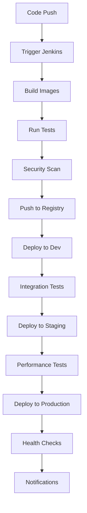

# 🚀 Jenkins CI/CD Pipeline for Microservice Admin App

This directory contains comprehensive Jenkins pipeline configurations for building, testing, and deploying the Microservice Admin App across multiple environments and container registries.

## 📁 Directory Structure

```
jenkins/
├── pipelines/
│   ├── Jenkinsfile-DockerHub           # Docker Hub integration pipeline
│   ├── Jenkinsfile-GitHubRegistry      # GitHub Container Registry pipeline
│   ├── Jenkinsfile-AnsibleDeployment   # Ansible deployment automation
│   ├── Jenkinsfile-Terraform           # Infrastructure as Code pipeline
│   └── Jenkinsfile-Kubernetes          # Kubernetes deployment pipeline
├── scripts/
│   ├── jenkins-utils.sh                # Utility scripts for common operations
│   └── shared-library.groovy           # Shared Jenkins library functions
└── README.md                           # This file
```

## 🎯 Pipeline Overview

### 1. **Jenkinsfile-DockerHub** 🐳
- **Purpose**: Complete Docker Hub integration with comprehensive testing
- **Features**:
  - Parallel builds for all services (frontend, backend, database)
  - Comprehensive testing suite (unit, integration, security)
  - Docker Hub push/pull verification
  - Health checks and performance testing
  - Detailed reporting and notifications

### 2. **Jenkinsfile-GitHubRegistry** 📦
- **Purpose**: GitHub Container Registry integration with comparison testing
- **Features**:
  - Dual registry support (Docker Hub + GHCR)
  - Registry comparison and validation
  - Automated deployment pipeline triggering
  - Advanced image management and cleanup

### 3. **Jenkinsfile-AnsibleDeployment** 🔧
- **Purpose**: Full Ansible deployment automation
- **Features**:
  - Multi-environment support (dev, staging, production)
  - Multiple deployment strategies (rolling, blue-green, canary)
  - Dynamic inventory generation
  - Comprehensive health checks and rollback capabilities

### 4. **Jenkinsfile-Terraform** 🏗️
- **Purpose**: Infrastructure as Code management
- **Features**:
  - Complete AWS infrastructure provisioning
  - State management and validation
  - Resource monitoring and cost optimization
  - Security compliance and backup strategies

### 5. **Jenkinsfile-Kubernetes** ☸️
- **Purpose**: Kubernetes deployment and management
- **Features**:
  - Dynamic manifest generation
  - Multiple deployment strategies
  - Autoscaling and ingress configuration
  - Comprehensive health monitoring

## 🛠️ Prerequisites

### Jenkins Setup
1. **Jenkins Version**: 2.400+ with Pipeline plugin
2. **Required Plugins**:
   - Pipeline
   - Docker Pipeline
   - Kubernetes CLI
   - Ansible
   - Email Extension
   - Slack Notification (optional)

### Credentials Configuration
Configure the following credentials in Jenkins:

```bash
# Docker Hub
dockerhub-credentials          # Username/Password

# GitHub
github-token                   # Secret Text (Personal Access Token)

# AWS (for Terraform)
aws-access-key-id             # Secret Text
aws-secret-access-key         # Secret Text

# SSH Keys
ssh-private-key               # SSH Username with private key

# Kubernetes
kubeconfig                    # Secret File

# Database
db-credentials                # Username/Password
```

### System Requirements
- **Docker**: 20.10+
- **kubectl**: 1.25+
- **Helm**: 3.10+
- **Ansible**: 4.0+
- **Terraform**: 1.5+
- **Node.js**: 16+ (for testing tools)

## 🚀 Getting Started

### 1. **Create Jenkins Jobs**

For each pipeline, create a new Pipeline job in Jenkins:

1. **New Item** → **Pipeline**
2. **Pipeline Definition**: Pipeline script from SCM
3. **SCM**: Git
4. **Repository URL**: Your repository URL
5. **Script Path**: `jenkins/pipelines/Jenkinsfile-<Name>`

### 2. **Configure Parameters**

Each pipeline supports various parameters. Key parameters include:

- **IMAGE_VERSION**: Docker image version to build/deploy
- **ENVIRONMENT**: Target environment (dev/staging/production)
- **REGISTRY_SOURCE**: Container registry (dockerhub/github)
- **DEPLOYMENT_STRATEGY**: Deployment approach (rolling/blue-green/canary)

### 3. **Set Up Webhook Triggers**

Configure GitHub webhooks to trigger builds automatically:

```bash
# Webhook URL
https://your-jenkins-server/github-webhook/

# Events to trigger
- Push to main/develop branches
- Pull request creation/update
- Release creation
```

## 📋 Pipeline Execution Flow

### Typical CI/CD Workflow



### Pipeline Dependencies

1. **DockerHub Pipeline** → Builds and pushes base images
2. **GitHub Registry Pipeline** → Mirrors images to GHCR
3. **Ansible Deployment** → Deploys to traditional servers
4. **Kubernetes Pipeline** → Deploys to K8s clusters
5. **Terraform Pipeline** → Manages infrastructure

## 🔧 Utility Scripts

### jenkins-utils.sh

Comprehensive utility script for common operations:

```bash
# Check prerequisites
./jenkins-utils.sh check-prerequisites

# Build and push images
./jenkins-utils.sh build v1.2.3
./jenkins-utils.sh push-dockerhub v1.2.3

# Local development
./jenkins-utils.sh start-local
./jenkins-utils.sh stop-local

# Deployment
./jenkins-utils.sh deploy-staging v1.2.3
./jenkins-utils.sh deploy-production v1.2.3

# Monitoring and maintenance
./jenkins-utils.sh status
./jenkins-utils.sh logs backend k8s-staging
./jenkins-utils.sh backup-db production

# Version management
./jenkins-utils.sh generate-version minor
./jenkins-utils.sh create-release minor
```

### shared-library.groovy

Reusable Jenkins functions:

```groovy
// Load shared library
def utils = load 'jenkins/scripts/shared-library.groovy'

// Use functions in pipeline
utils.buildDockerImage('nginx_frontend', '1.2.3')
utils.pushToDockerHub('nginx_frontend', '1.2.3', 'shivamsingh163248')
utils.runHealthCheck('http://localhost:8081')
utils.deployWithAnsible('deploy.yml', 'staging', '1.2.3')
```

## 🎯 Environment Configuration

### Development Environment
- **Namespace**: `dev-microservice-admin-app`
- **Replicas**: 1
- **Resources**: Minimal (for cost optimization)
- **Autoscaling**: Disabled
- **Monitoring**: Basic

### Staging Environment
- **Namespace**: `staging-microservice-admin-app`
- **Replicas**: 2
- **Resources**: Production-like
- **Autoscaling**: Enabled
- **Monitoring**: Full monitoring stack

### Production Environment
- **Namespace**: `production-microservice-admin-app`
- **Replicas**: 3+
- **Resources**: High availability
- **Autoscaling**: Enabled with strict policies
- **Monitoring**: Full monitoring + alerting

## 📊 Monitoring and Alerting

### Health Check Endpoints
- **Frontend**: `http://localhost:8081/`
- **Backend**: `http://localhost:5001/health`
- **Database**: MySQL connection test

### Notification Channels
- **Slack**: `#deployments` channel
- **Email**: Development team
- **Webhook**: External monitoring systems

### Key Metrics
- **Build Success Rate**: >95%
- **Deployment Time**: <10 minutes
- **Test Coverage**: >80%
- **Security Vulnerabilities**: 0 high/critical

## 🔒 Security Considerations

### Image Security
- **Vulnerability Scanning**: Trivy integration
- **Base Images**: Official, minimal images
- **Secrets Management**: Kubernetes secrets/environment variables
- **Registry Security**: Private repositories with access controls

### Pipeline Security
- **Credential Management**: Jenkins credential store
- **Access Controls**: Role-based permissions
- **Audit Logging**: All pipeline activities logged
- **Code Signing**: Git commit verification

## 🐛 Troubleshooting

### Common Issues

#### Build Failures
```bash
# Check Docker daemon
docker info

# Verify credentials
jenkins-utils.sh check-prerequisites

# Review build logs
docker logs <container-id>
```

#### Deployment Issues
```bash
# Check cluster connectivity
kubectl cluster-info

# Verify namespace
kubectl get namespaces

# Check pod status
kubectl get pods -n <namespace>

# View logs
kubectl logs -f deployment/<service> -n <namespace>
```

#### Performance Issues
```bash
# Check resource usage
kubectl top pods -n <namespace>

# Review HPA status
kubectl get hpa -n <namespace>

# Check cluster resources
kubectl describe nodes
```

### Debug Commands

```bash
# Pipeline debugging
./jenkins-utils.sh logs all local
./jenkins-utils.sh status

# Kubernetes debugging
kubectl describe pod <pod-name> -n <namespace>
kubectl exec -it <pod-name> -n <namespace> -- /bin/bash

# Docker debugging
docker-compose logs
docker system df
docker system prune
```

## 📈 Performance Optimization

### Build Optimization
- **Multi-stage Dockerfiles**: Reduce image size
- **Layer Caching**: Optimize Docker layer order
- **Parallel Builds**: Utilize Jenkins parallel stages
- **Resource Allocation**: Appropriate CPU/memory limits

### Deployment Optimization
- **Rolling Deployments**: Zero-downtime updates
- **Health Checks**: Fast startup verification
- **Resource Requests**: Proper resource planning
- **Autoscaling**: Dynamic resource management

## 🔄 Backup and Recovery

### Database Backups
```bash
# Automated backups
./jenkins-utils.sh backup-db production

# Restore from backup
./jenkins-utils.sh restore-db backup_20231215_143022.sql production
```

### Configuration Backups
- **Jenkins Configuration**: Regular exports
- **Kubernetes Manifests**: Version controlled
- **Ansible Playbooks**: Git repository
- **Terraform State**: S3 backend with versioning

## 📚 Additional Resources

### Documentation
- [Jenkins Pipeline Syntax](https://jenkins.io/doc/book/pipeline/syntax/)
- [Docker Best Practices](https://docs.docker.com/develop/dev-best-practices/)
- [Kubernetes Documentation](https://kubernetes.io/docs/)
- [Ansible Documentation](https://docs.ansible.com/)
- [Terraform Documentation](https://terraform.io/docs/)

### Training Materials
- [Jenkins Pipeline Tutorial](https://jenkins.io/doc/tutorials/)
- [Docker Fundamentals](https://docker-curriculum.com/)
- [Kubernetes Basics](https://kubernetes.io/docs/tutorials/kubernetes-basics/)

## 🤝 Contributing

### Pipeline Development
1. **Fork** the repository
2. **Create** feature branch
3. **Test** pipeline changes
4. **Submit** pull request

### Code Standards
- **Groovy**: Jenkins pipeline best practices
- **Shell Scripts**: POSIX compliance
- **Documentation**: Clear, comprehensive comments
- **Testing**: Validate all pipeline stages

## 📞 Support

### Contact Information
- **DevOps Team**: devops@company.com
- **Jenkins Admin**: jenkins-admin@company.com
- **Emergency**: +1-xxx-xxx-xxxx

### Issue Reporting
- **Jenkins Issues**: Internal ticketing system
- **Code Issues**: GitHub Issues
- **Security Issues**: security@company.com

---

## 🎉 Quick Start Example

```bash
# 1. Clone repository
git clone <your-repo-url>
cd microservice-admin-app

# 2. Make utility script executable
chmod +x jenkins/scripts/jenkins-utils.sh

# 3. Check prerequisites
./jenkins/scripts/jenkins-utils.sh check-prerequisites

# 4. Start local development
./jenkins/scripts/jenkins-utils.sh start-local

# 5. Build and test
./jenkins/scripts/jenkins-utils.sh build v1.0.0
./jenkins/scripts/jenkins-utils.sh run-tests

# 6. Deploy to staging
./jenkins/scripts/jenkins-utils.sh deploy-staging v1.0.0

# 7. Monitor deployment
./jenkins/scripts/jenkins-utils.sh status
./jenkins/scripts/jenkins-utils.sh logs all k8s-staging
```

**🚀 Your Jenkins CI/CD pipeline is now ready for enterprise-grade deployment automation!**
